# Instalasi GIT

Lewati modul ini jika anda sudah mempunyai Git pada sistem operasi anda.

## Langkah-langkah installasi

Berikut ini langkah langkah installasi git pada sistem operasi windows 10.

### Double click installer dan ikuti langkah langkahnya

Halaman lisensi git, perhatikan lisensi nya dengan seksama apabila anda tidak cocok dengan lisensi yang di berikan jangan melanjutkan installasi :)

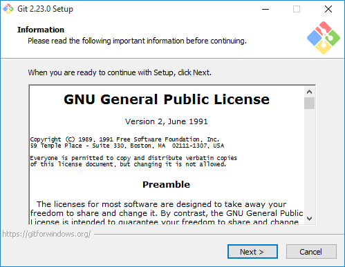

Pilihlah lokasi install yang sesuai menurut kebutuhan anda :

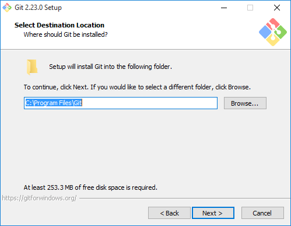

Pilihlah komponen komponen Git yang anda butuhkan, jika tidak mengerti biarkan sesuai dengan opsi default

Pilihlah apakah akan menambahkan git ke start menu :

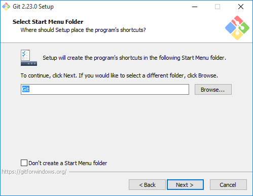

Pilihlah default editor untuk git, pada installer ini menggunakan vim, jika anda tidak familiar pilihlah text editor lain

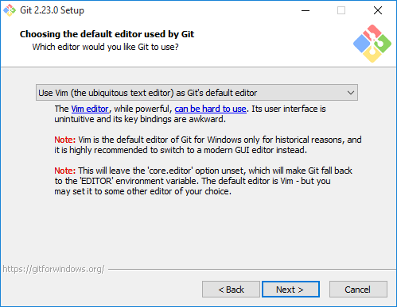

Setting path environment pilihlah pilihan kedua untuk dapat menjalankan git baik dari terminal bawaan windows dan git bash

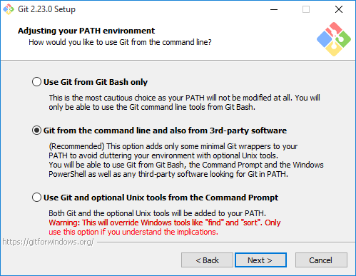

Untuk https transport backend pilihlah OpenSSL

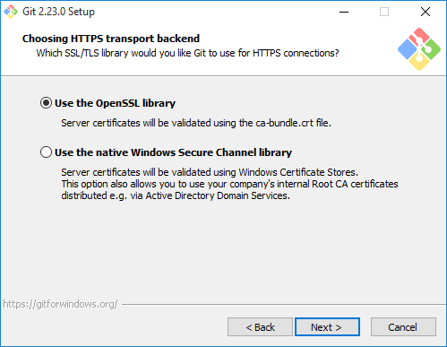

Untuk pilihan selanjutnya gunakan opsi default jika anda tidak mengerti pilihan yang diberikan

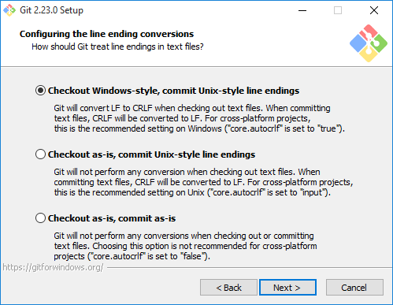

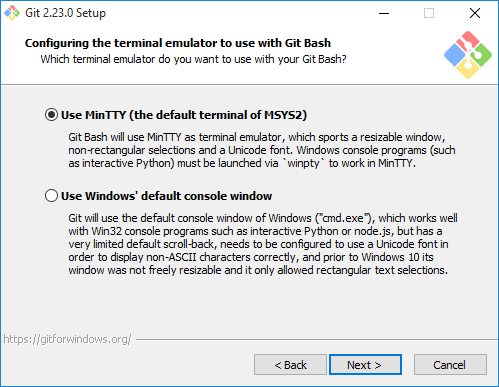

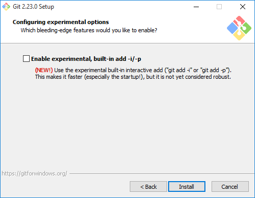

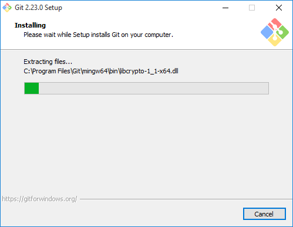

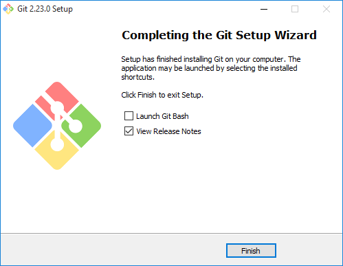

Setelah proses install selesai bukalah command promt anda dan ketikkan perintah `git` jika git berhasil dijalankan akan tampil oputput seperti pada gambar dibawah ini

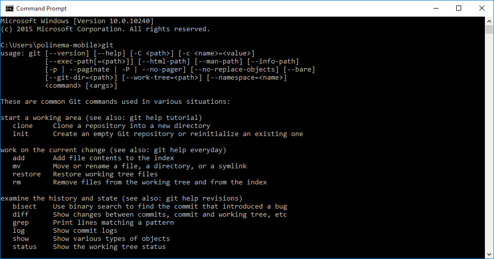
