# Instalasi JAVA SDK

Lewati modul ini jika anda sudah memiliki Java SDK di komputer anda, untuk
mengecek installasi Java pada komputer silahkan buka terminal (command prompt)
dan ketikkan command `java` dan `javac` jika kedua perintah tersebut menampilkan
hasil yang benar maka lewati bagian ini. Contoh hasil terminal jika JDK belum
terinstall dengan benar.

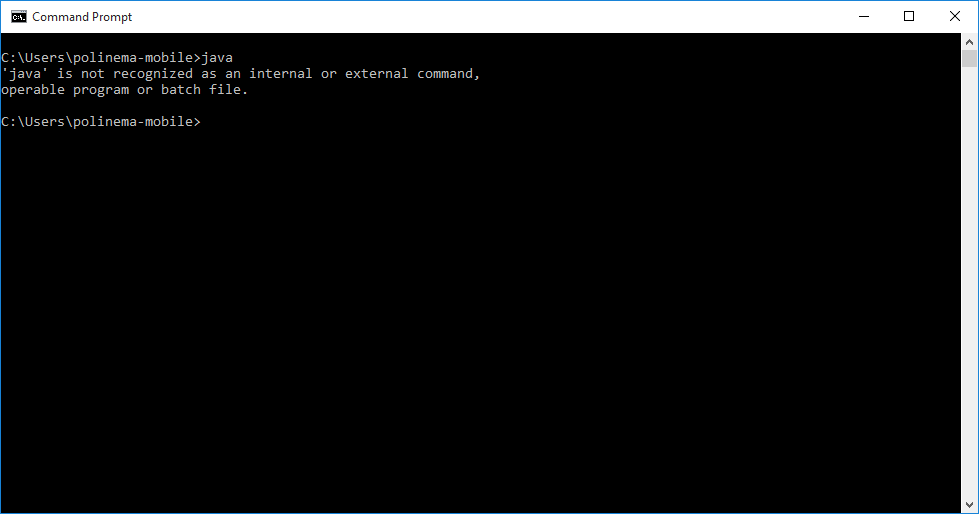

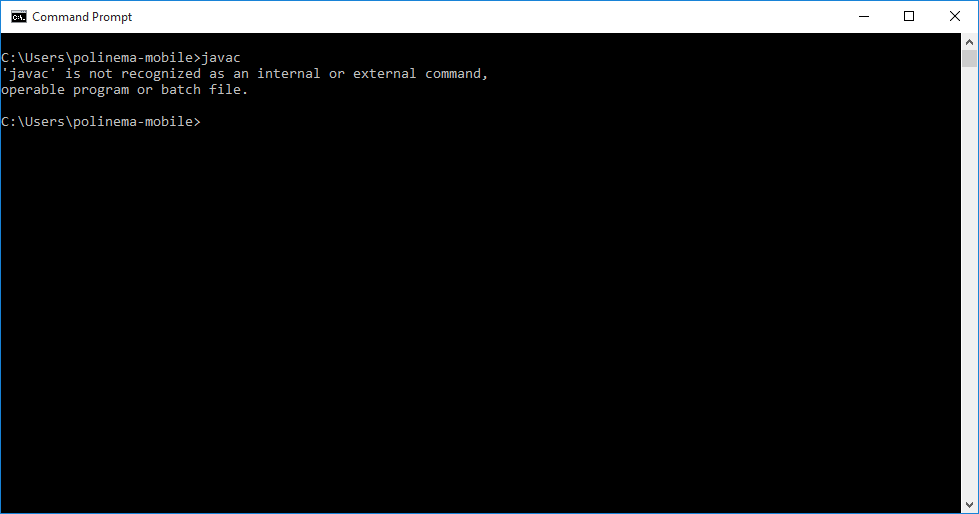

Jika kedua perintah tersebut gagal dilakukan berarti anda belum menginstall JRE dan JDK dengan benar.

## Langkah-langkah installasi

### Klik Installer dan ikuti langkah langkahnya

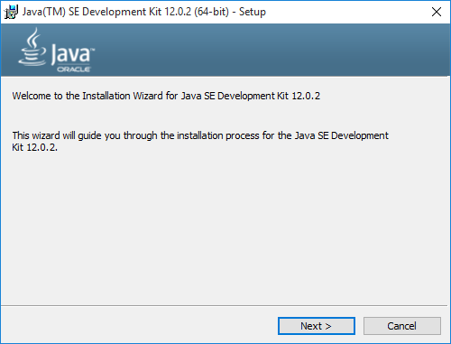

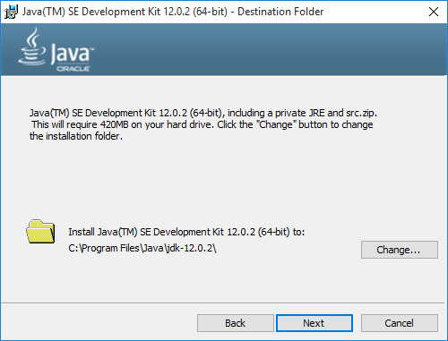

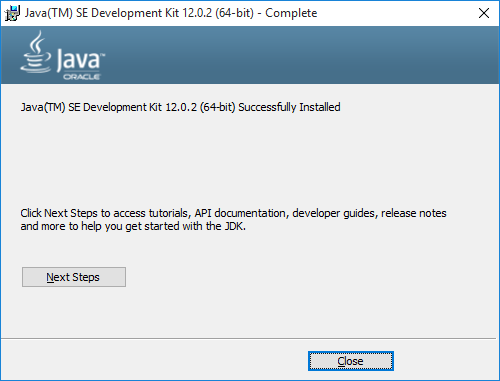

### Setting System Environment

Bukalah system environment variables pada komputer anda kemudian klik tombol Environment Variables

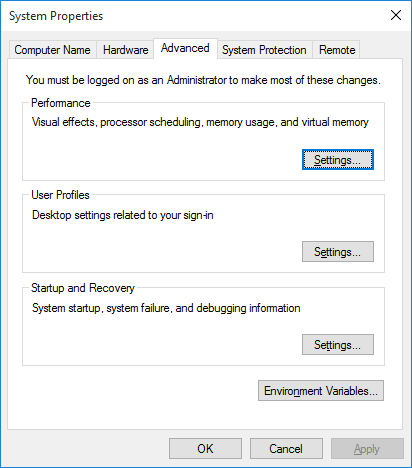

Buatlah entry baru pada input System Variables, beri nama sesuai gambar `Variable Name : JAVA_HOME` dan `Variable Value : path install jdk pada komputer anda`

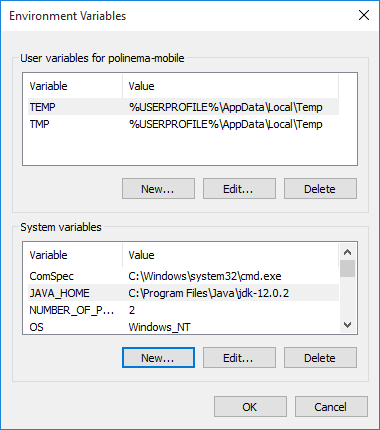

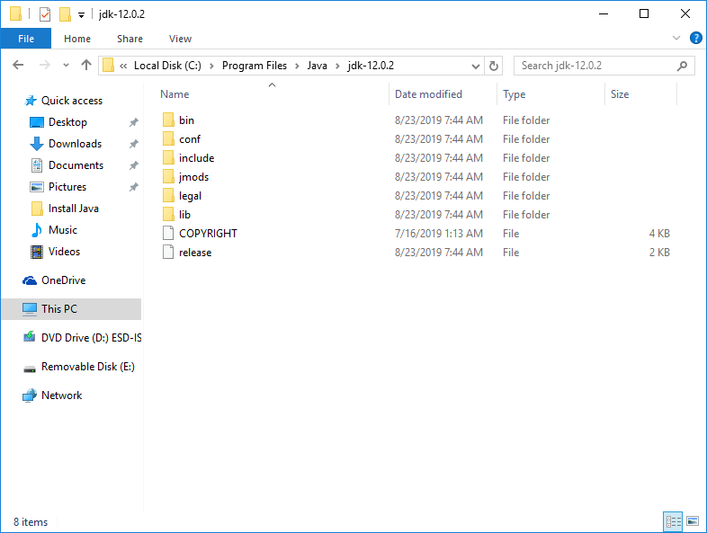

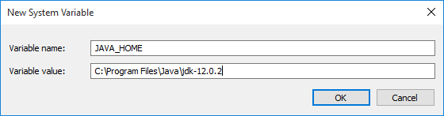

Edit System Variable dengan nama `Path` dan tambahkan `%JAVA_HOME%\bin`

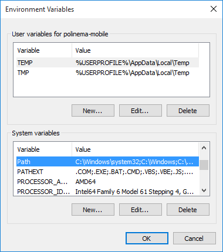

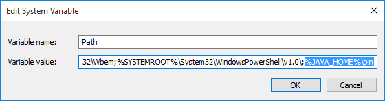

3. Restart Command Prompt
4. Ketikkan Perintah `java` dan `javac` untuk menguji hasil installasi

   

   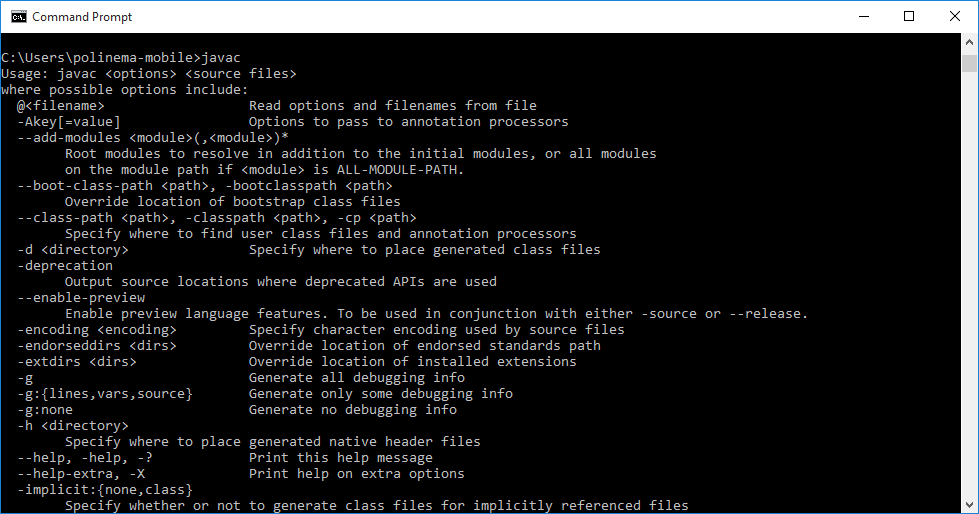
