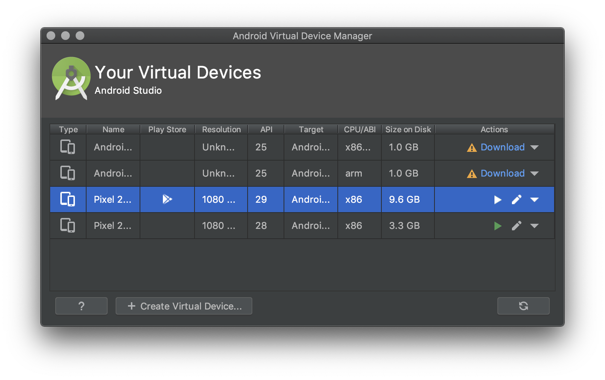
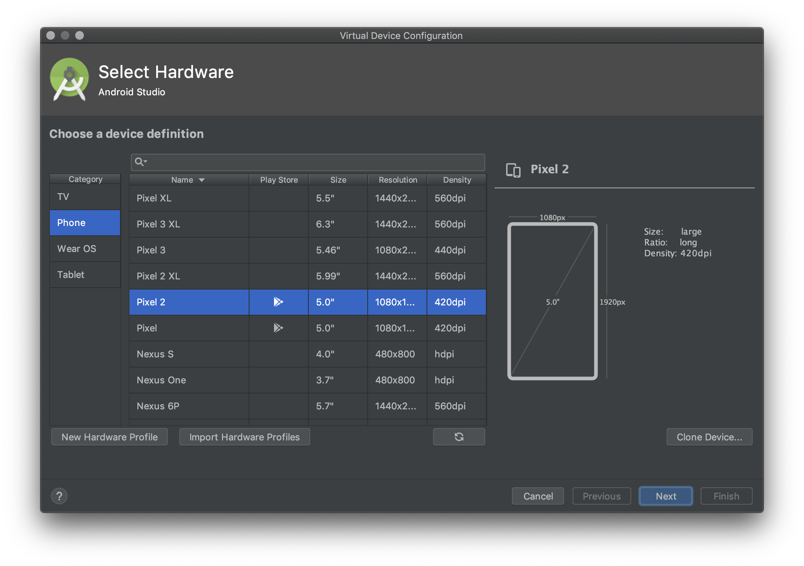

# Instalasi Emulator Android

> **Catatan**: Langkah ini diperlukan jika ingin menggunakan emulator Android.

## Langkah-langkah

Untuk memudahkan pengembangan aplikasi Android anda dapat menggunakan Emulator.

- Silahkan buka aplikasi **Android Studio**
- Pada tampilan Welcome Screen, carilah menu **Configure** yang ada pada pojok
 bawah.
- Pilih menu **AVD Manager**
- Pada tampilan AVD Manager, tekan tombol **Create Virtual Device**

- Pilih Device sesuai kebutuhan anda, kemudian tekan tombol **Next**

- Pilih Versi API, kemudian tekan tombol **Next**
- Beri nama **AVD Name** anda, kemudian tekan tombol **Finish**
