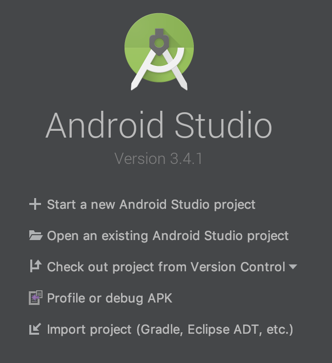
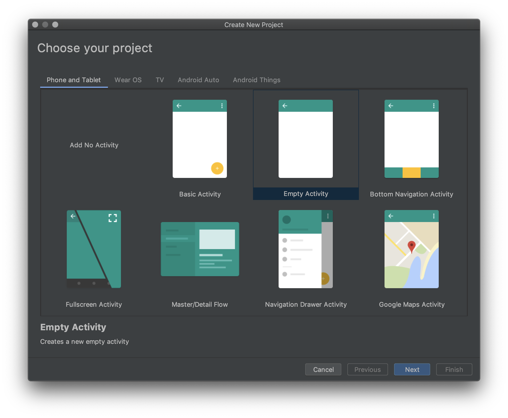
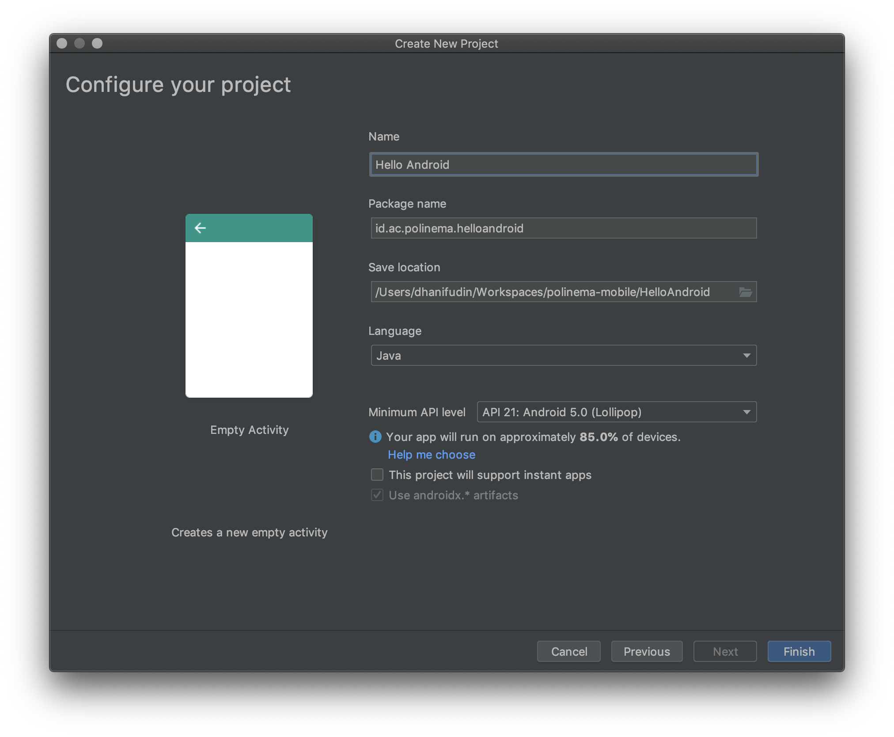

# Hello Android

Pada bagian ini anda akan mempelajari langkah-langkah untuk membuat project
Android. Silahkan ikuti langkah-langkah di bawah ini:

- Pada **Welcome Screen** pilih menu **Start a new Android Studio project**

- Pilih **Empty Activity**

- Beri nama project Android anda **Hello Android**

> **Catatan**: *Package name* merupakan id aplikasi, umumnya formatnya berupa
> `identifier.applicationname`. Format identifier merupakan nama domain pemilik
> aplikasi, tetapi dengan ketentuan penulisannya dibalik. Contoh: domain
> `polinema.ac.id` maka ditulis menjadi `id.ac.polinema`, domain `dhanifudin.com`
> menjadi `com.dhanifudin`.

- Pilih bahasa yang digunakan yaitu: Java

- Tunggu proses build hingga selesai.
- Jalankan project anda dengan menekan tombol segitiga hijau.

- Deploy aplikasi anda dengan target device yang diinginkan.
