# Struktur Folder Project Android

Pada sub bab ini anda akan mempelajari mengenai struktur folder pada sebuah project android. Berikut ini struktur folder default kode program android pada android studio.
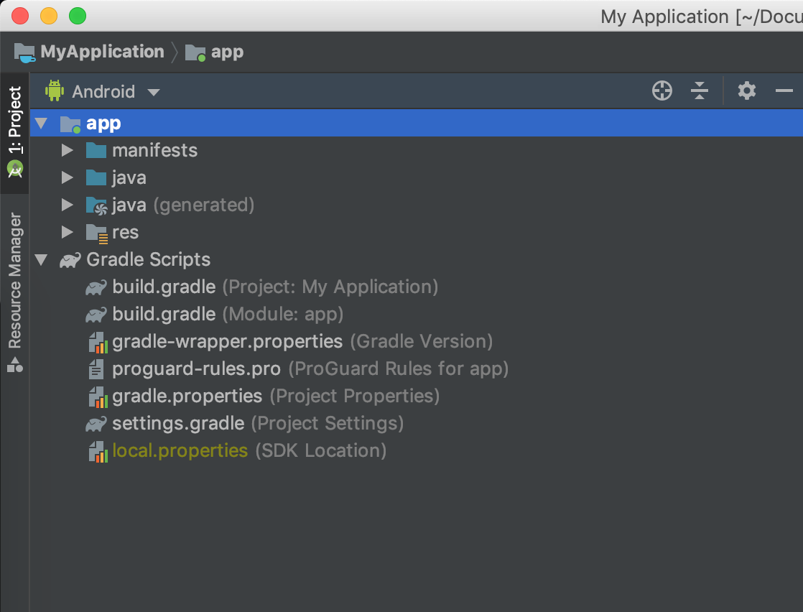

Perthatikan sebuah dropdown di atas folder tree jika pada gambar sebelumnya digunakan "view" project android banyak view lain yang dapat digunakan daftar "view" dapat anda lihat dengan melakukan klik pada dropdown tersebut.

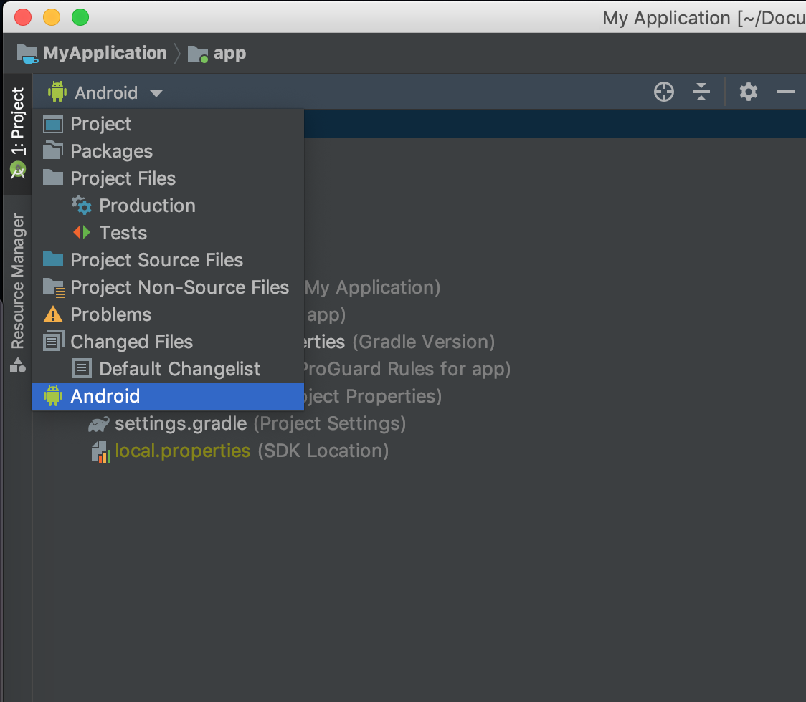

Berikut ini tampilan file tree jika view diganti ke "Project"

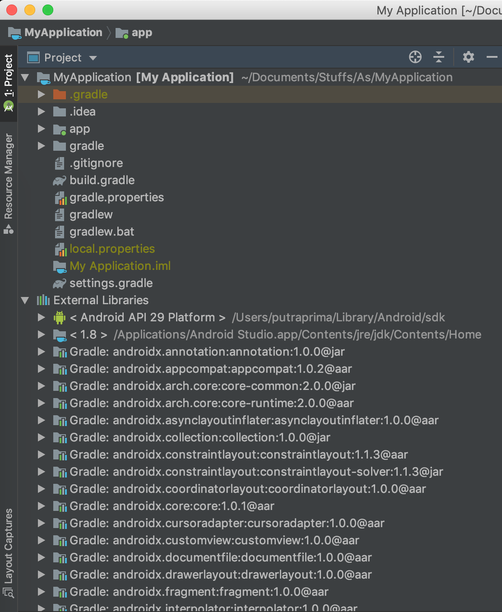

Karena view project yang paling umum digunakan adalah "android" kembalikanlah view kembali ke "android" sehingga file tree anda kembali pada gambar pertama.

## Manifest

Pada folder manifest terdapat file yang berisi informasi mengenai permission, fitur dan activity/fragment yang digunakan.

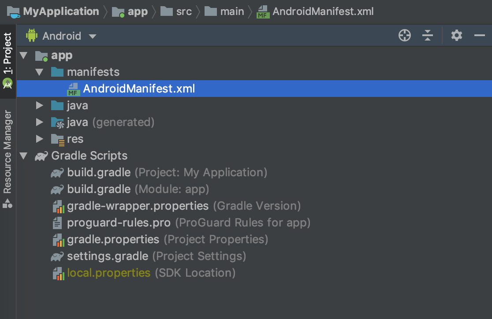

Berikut ini isi dari file manifest pada sebuah template "Hello World"

```xml
<?xml version="1.0" encoding="utf-8"?>
<manifest xmlns:android="http://schemas.android.com/apk/res/android"
    package="polinema.ac.id.myapplication">

    <application
        android:allowBackup="true"
        android:icon="@mipmap/ic_launcher"
        android:label="@string/app_name"
        android:roundIcon="@mipmap/ic_launcher_round"
        android:supportsRtl="true"
        android:theme="@style/AppTheme">
        <activity android:name=".MainActivity">
            <intent-filter>
                <action android:name="android.intent.action.MAIN" />

                <category android:name="android.intent.category.LAUNCHER" />
            </intent-filter>
        </activity>
    </application>

</manifest>
```

Pada file ini dapat anda lihat bahwa terdapat beberapa informasi penting mengenai aplikasi yang dibuat mulai dari :

```xml
<manifest xmlns:android="http://schemas.android.com/apk/res/android"
    package="polinema.ac.id.myapplication">
```

Potongan kode manifest di atas menunjukkan bahwa package name yang digunakan adalah "polinema.ac.id.myapplication" impplikasinya adalah semua kode program pada folder java harus menggunakan nama package ini.

Potongan kode selanjutnya adalah :

```xml
    <application
        android:allowBackup="true"
        android:icon="@mipmap/ic_launcher"
        android:label="@string/app_name"
        android:roundIcon="@mipmap/ic_launcher_round"
        android:supportsRtl="true"
        android:theme="@style/AppTheme">
```

Pada kode xml ini di setting nama aplikasi, icon launcher, support rtl, dan tema aplikasi

Selanjutnya pada tag `activity` berisi informasi mengenai activity yang dimiliki oleh aplikasi

```xml
        <activity android:name=".MainActivity">
            <intent-filter>
                <action android:name="android.intent.action.MAIN" />

                <category android:name="android.intent.category.LAUNCHER" />
            </intent-filter>
        </activity>
```

Perhatikan pada tag `intent-filter` terdapat tag child `category` dengan properties `android.intent.category.LAUNCHER` ini menandakan bahwa activity pada tag ini merupakan activity yang **pertama** kali dibuka

## Java

Isi dari folder java dapat dilihat pada gambar dibawah ini :

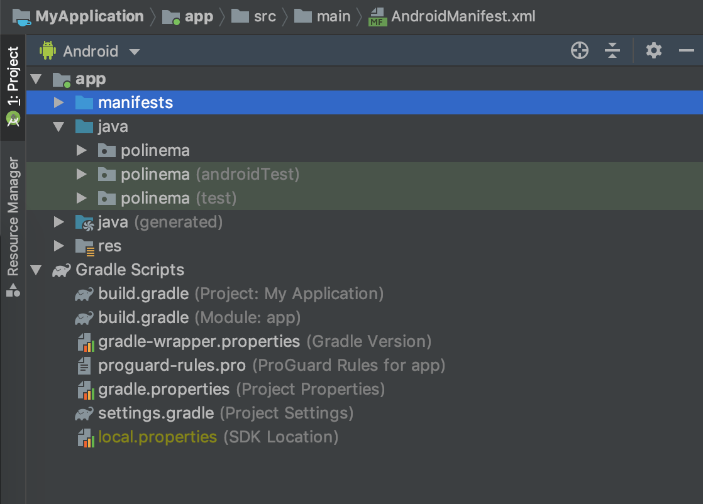

Perhatikan terdapat tiga folder dengan nama yang sama sesuai dengan package name pada file manifest, dimana pada manifest package name nya adalah `polinema.ac.id.myapplication` maka pada folder java terdapat folder dengan nama yang sesuai dengan potongan pertama pada package name yaitu `polinema`

Masing masing folder walaupun mempunyai nama yang sama memiliki fungsi yang berbeda, folder pertama berisi kode program, folder kedua dan ketiga berisi file testing untuk aplikasi.

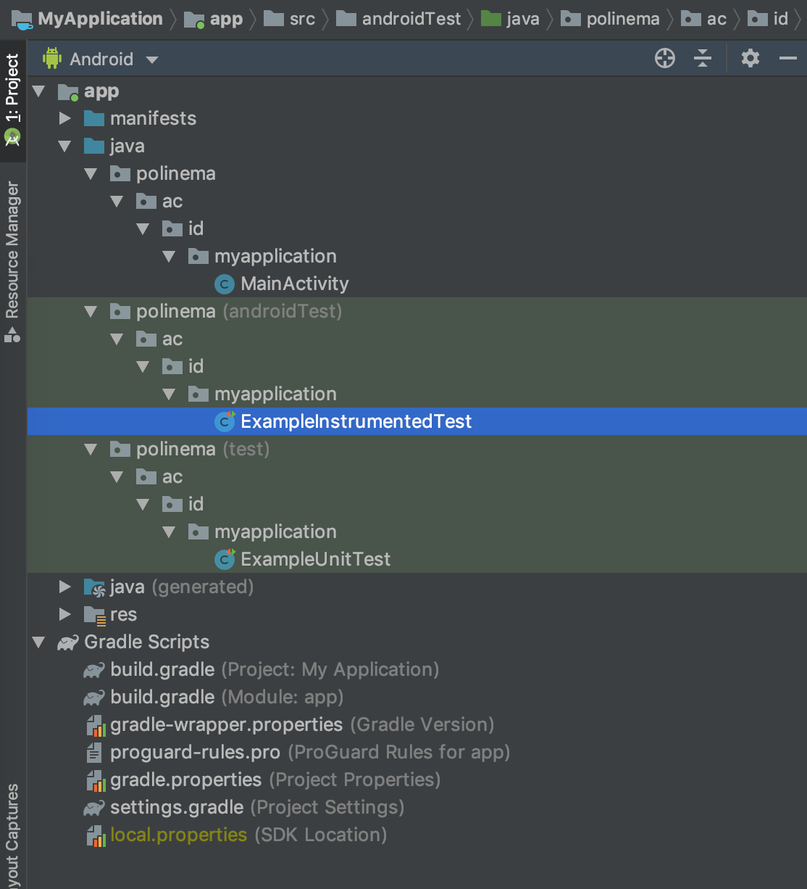

Tampilan pada Android studio anda bisa jadi sedikit berbeda dengan tampilan pada screenshot, hal ini bisa di lakukan dengan merubah option menu pada file tree berikut ini :

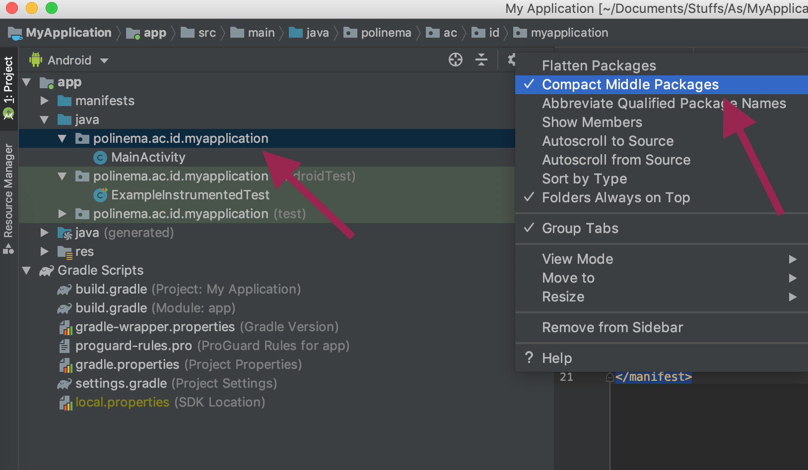

## Java(Generated)

Pada Folder ini berisi kode program yang di generate oleh android studio, dalam kondisi apapun anda sebaiknya tidak merubah kode program pada folder ini.

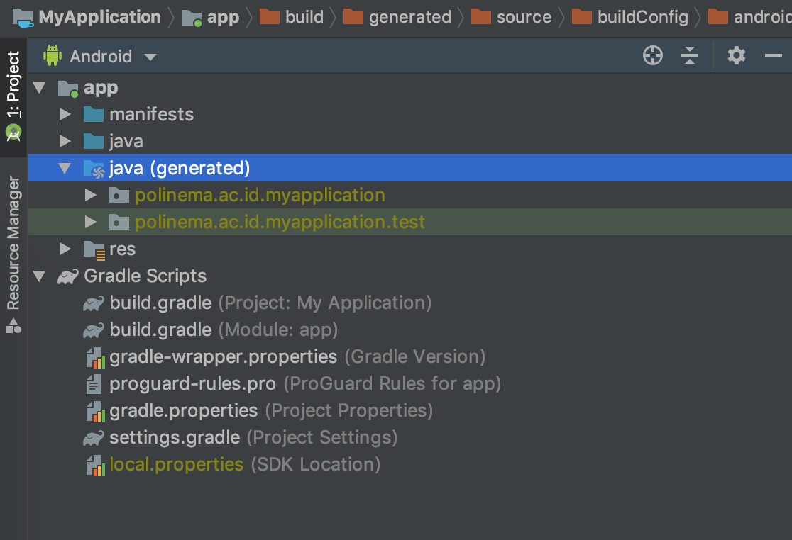

## Res

Folder selanjutnya adalah folder res, dimana pada folder ini berisi semua resource lokal yang dibutuhkan untuk pembuatan aplikasi selain kode program. Isi default folder ini adalah `drawable`, `layout`,`mimpap`, dan `values`

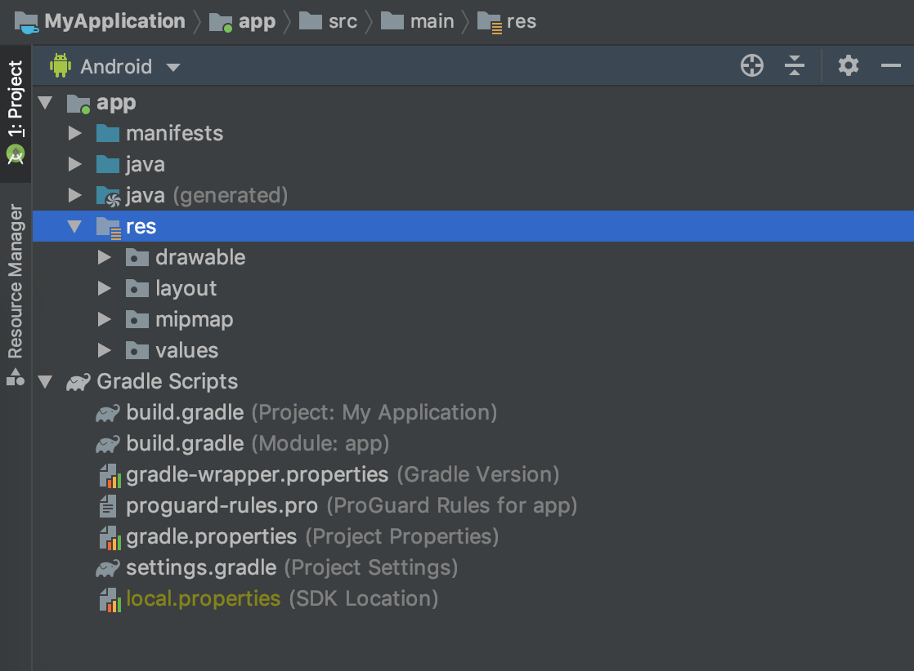

Isi pada folder drawable dapat berupa sebuah gambar atau xml drawable dengan syarat penamaan pada folder ini tidak boleh menggunakan angka, huruf kapital dan menggunakan underscore sebagai penghubung antar kata (jika ada spasi).

Isi pada folder layout adalah layout xml yang digunakan untuk membuat tampilan activity atau fragment pada android studio. Layout ini menggunakan tag xml dimana pembuatannya memiliki aturan aturan sendiri seperti pada pembuatan html untuk aplikasi web. Pembahasan mengenai layout akan diperdalam pada pertemuan pertemuan selanjutnya.

Isi pada folder mipmap adalah logo aplikasi perhatikan ada beberapa resolusi yang harus disediakan oleh sebuah gambar untuk dapat menjadi logo aplikasi yang baik hdpi, mdpi, xhdpi, xxhdipi,xxxhdpi.

Isi pada folder values berupa file xml yang mengatur warna, string ,dan style pada aplikasi.

Isi folder res akan dibahas lebih dalam pada pertemuan mengenai desain layout dan fragment.

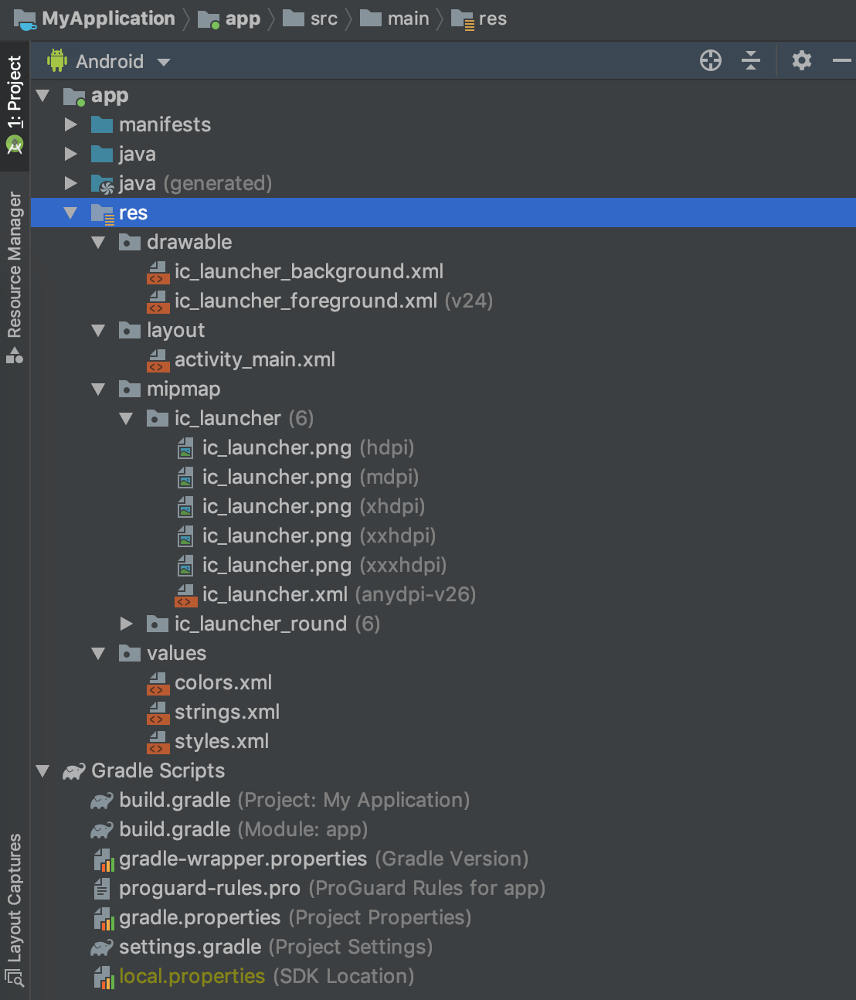

## Gradle scripts

Gradle merupakan build system yang digunakan oleh android studio, pada file ini berisi konfigurasi konfigurasi penting mengenai proses build aplikasi. File gradle pada sebuah project android studio terdiri dari dua level yaitu level `project` dan level `module` paling tidak sebuah project android memiliki 2 file gradle, jika project tersebut memiliki modul lebih dari satu maka file gradle nya akan bertambah sesuai dengan jumlah module yang dimiliki.

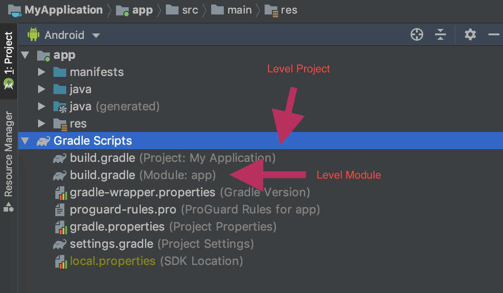

Berikut ini isi dari file gradle pada module app

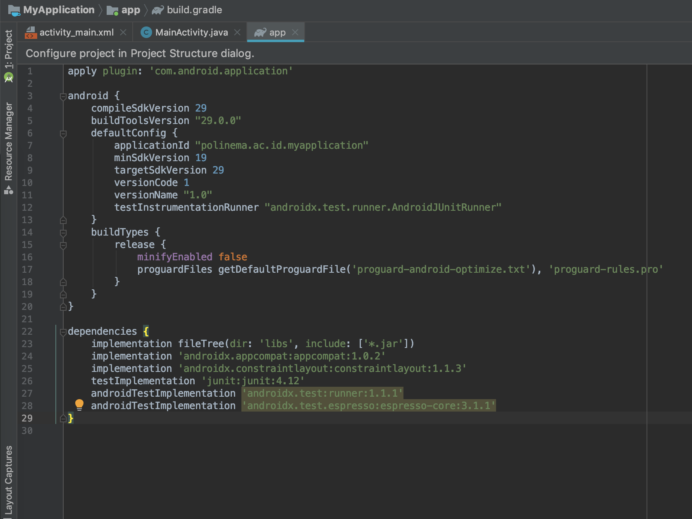

Pada file gradle ini berisi semua library dan konfigurasi yang digunakan untuk module app, anda akan sering mengubah dan mempelajari isi file ini seiring dengan berjalannya perkuliahan.

Sedangkan gradle pada level project berisi repository mana yang digunakan untuk memeriksa dependency aplikasi yang di isi pada file gradle module.

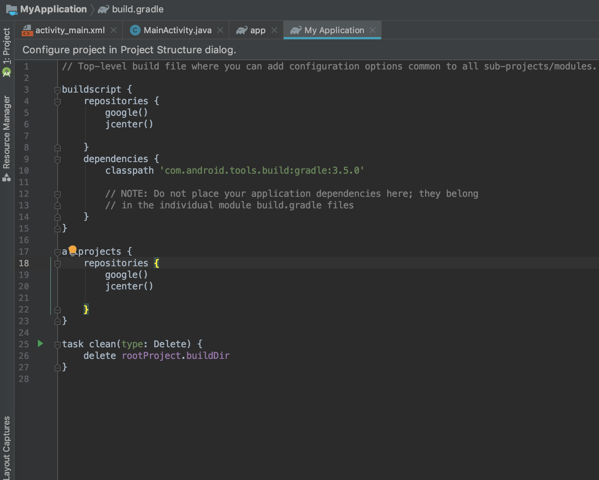

