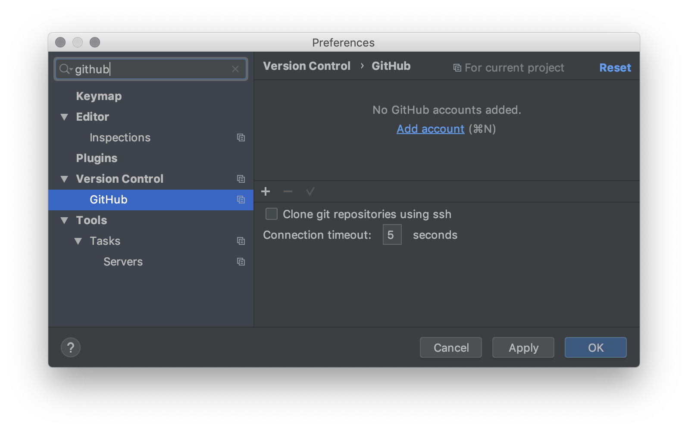
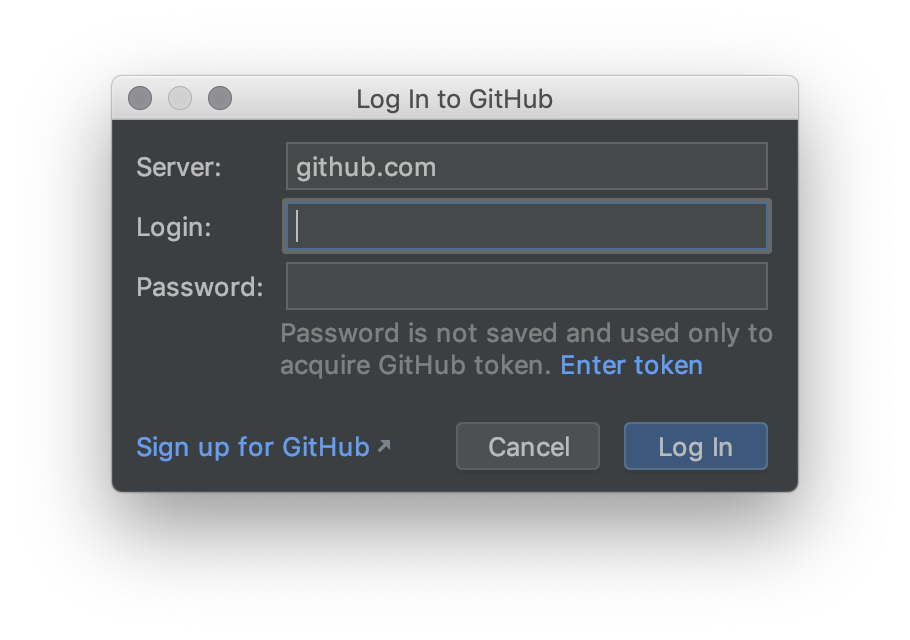
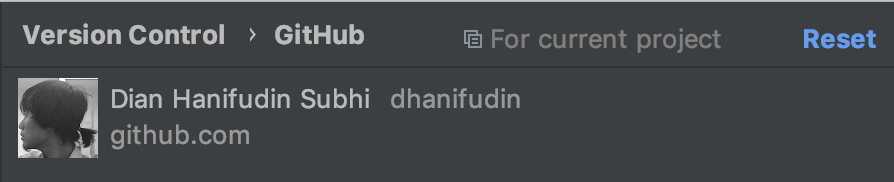
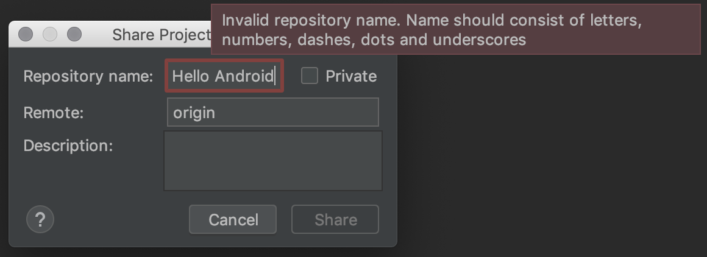
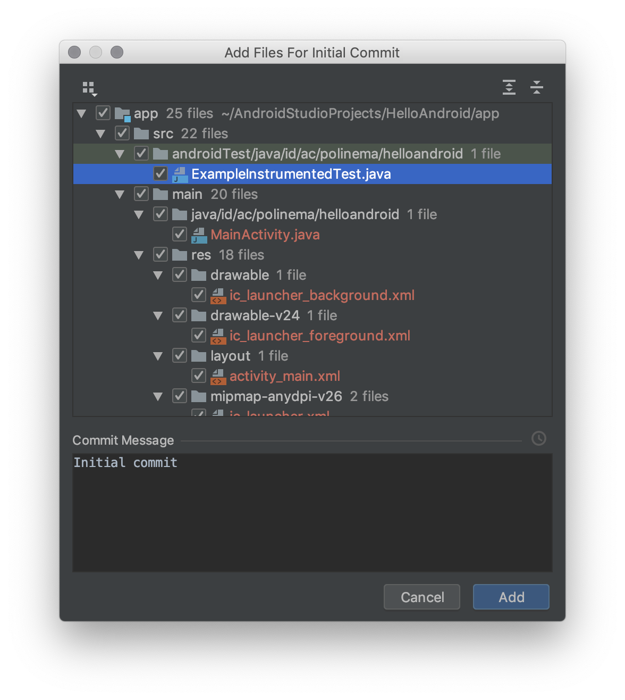
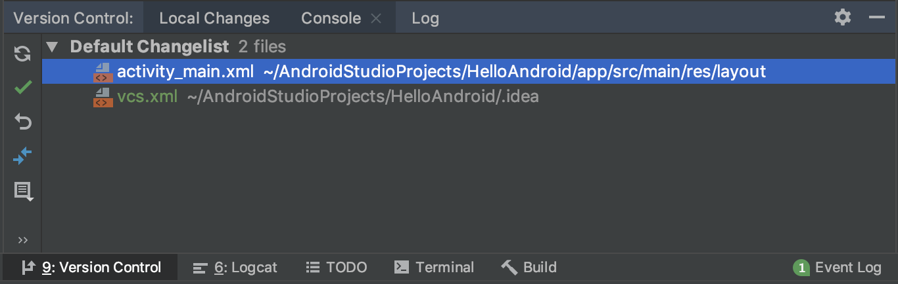
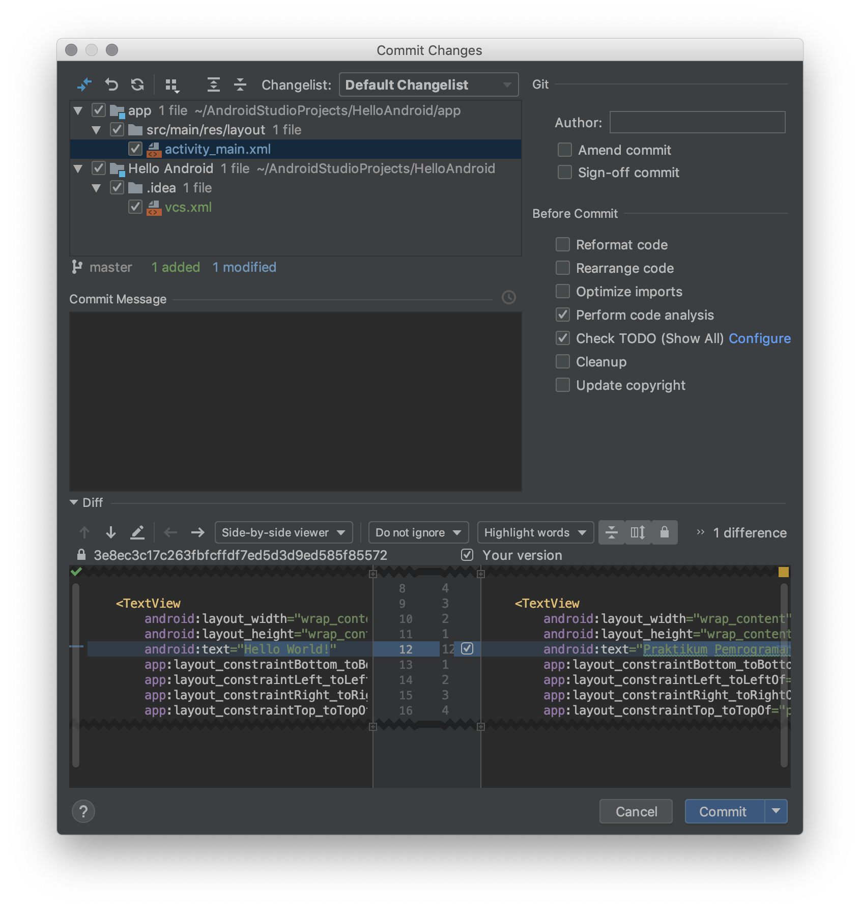

# Version Control

Pada sub bab ini akan dijelaskan mengenai version control pada Android Studio,
Version control adalah sebuah fitur untuk mengatur history kode program yang
kita buat. Android studio menyediakan support untuk berbagai macam version
control pada pertemuan kali ini akan dibahas mengenai Git dan Local History.

## Git

Git adalah Version Control System (VCS) terdistribusi yang diciptakan oleh Linus
Torvalds. Digunakan sebagai perkakas bantu untuk bekerja antar para programmer.
Git digunakan untuk melacak perubahan pada berkas-berkas code. Pada praktikum
ini digunakan [GitHub](https://github.com) yang merupakan salah satu penyedia
layanan Git di cloud.

## Akun GitHub

Sebelum melakukan langkah-langkah berikut, pastikan anda telah memiliki akun
[GitHub](http://github.com) terlebih dahulu. Untuk melakukan registrasi silahkan
klik tautan [Join GitHub](https://github.com/join) berikut. Kemudian lengkapi
formulir isian yang dibutuhkan.

## Setup GitHub pada Android Studio

Pada praktikum pemrograman mobile, digunakan Android Studio sebagai Git Client.
Terdapat beberapa langkah untuk menyiapkannya. Silahkan ikuti langkah-langkah
berikut:

- Buka aplikasi terminal (cmd) pada sistem operasi anda
- Untuk memeriksa apakah sudah terdapat setting akun Git, jalankan perintah `git
 config --global --get user.email`. Jika hasil perintah kosong, maka anda perlu
 mengkonfigurasi akun Git terlebih dahulu.
- Jalankan perintah di bawah ini untuk mengatur informasi akun Git berupa email
 (email akun GitHub) dan nama anda.

  ```
  git config --global  user.email "<youremail>@email.com"
  git config --global  user.name "<your name>"
  ```

- Buka aplikasi **Android Studio**, kemudian masuk ke **Settings**.
- Filter settings dengan keyword `github`, dan pilih menu `GitHub` pada bagian
 **Version Control**.

 

- Tambahkan akun baru dengan menekan **Add Account**, dan lengkapi informasi
 login dengan akun GitHub anda.

 

- Jika proses login berhasil maka akan muncul akun profil GitHub anda.

  

- Proses setup akun GitHub telah selesai.

## Membuat Repository GitHub via Android Studio

- Bukalah project **Hello Android** pada praktikum minggu lalu.
- Tunggu proses build hingga selesai.
- Klik menu **VCS** -> **Import into Version Control** -> **Share Project on GitHub**

  

- Jika anda perhatikan, maka ada pesan error yang muncul. Nama repository tidak
 mengijinkan adanya karakter spasi, ubah nama repository sehingga pesan error
 tidak muncul kembali. Kemudian tekan tombol **Share**.

- Tunggu proses sampai muncul dialog untuk konfirmasi menambahkan files ke
 repository. Terdapat isian **Commit Message** yang digunakan untuk memberikan
 deskripsi perubahan apa yang telah dilakukan.

  

- Tekan tombol **Add** untuk menambahkan perubahan file. Tunggu proses hingga
 keluar notifikasi pada **Android Studio** seperti pada gambar berikut.

  

- Bukalah fiile `activity_main.xml` kemudian ubah pesan `Hello World!` menjadi
 `Praktikum Pemrograman Mobile`.

- Perhatikan pada bagian bawah **Android Studio** terdapat toolbar **Version
 Control**. Buka toolbar tersebut atau anda dapat menggunakan shortcut `Ctrl +
 9` (`Cmd + 9` bagi pengguna OSX). Pada toolbar tersebut mencatat semua
 perubahan file yang terjadi dalam satu repository.

  

- Pilih file yang perubahannya ingin dicatat, kemudian tekan menu
 

- Akan muncul dialog yang menunjukkan file yang akan di-*commit* serta perbedaan
 (diff) file dengan versi file sebelumnya. Pada isian **Commit Message**
 digunakan untuk memberikan informasi perubahan. Silahkan isi pesan sesuai
 dengan perubahan yang dilakukan, contoh: `Merubah pesan menjadi Praktikum
 Pemrograman Mobile`. Kemudian tekan tombol **Commit** untuk melakukan commit.

  

