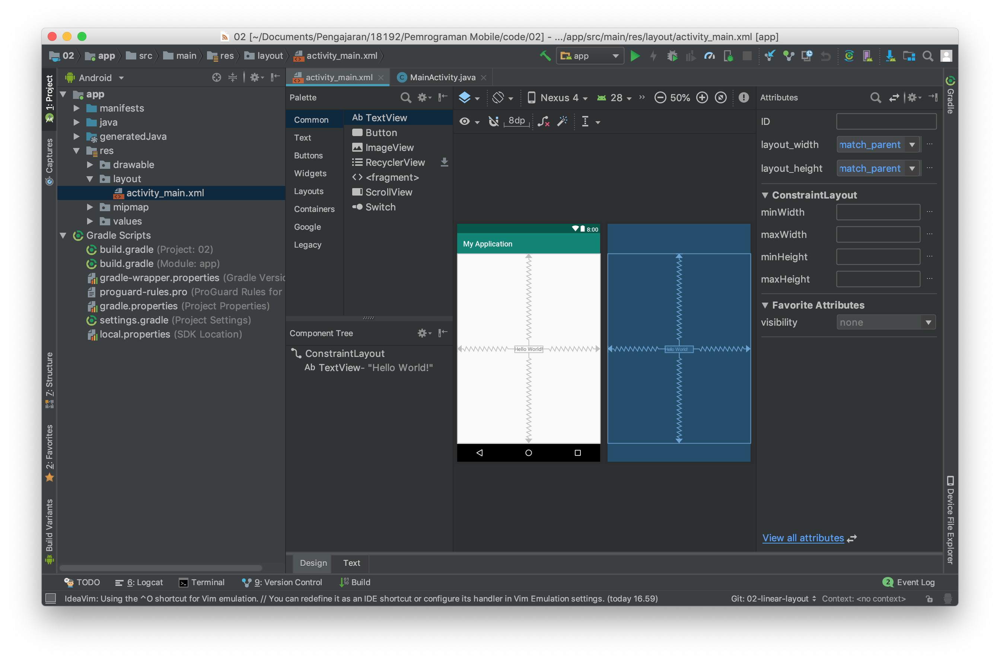

# Membuat Aplikasi dengan Constraint Layout

**Constraint layout** merupakan layout terbaru dari android. Layout ini berbasis relative layout, namun mempunyai tingkat kemudahan yang lebih baik dalam penggunaannya. Hal ini dikarenakan, contraint layout dapat digunakan dengan baik pada design mode didalam Android Studio.

Setiap item pada constraint layout memiliki 4 arah constraint yaitu _top_, _left_, _right_, dan _bottom_. Ke empat arah ini memiliki sebuah connection source yang dapat ditarik ke _parent_ atau ke objek lain. Perhatikan gambar di bawah ini.

Pada text view **hello world** terdapat 4 constraint dan masing masing constraint di hubungkan ke parent dengan mode panah bergerigi, panah bergerigi ini mewakili `wrap_content`. Pilihan lain selain wrap content adalah fixed dan match constraint. Silahkan mencoba dan berikan kesimpulan terhadap pengamatan dan percobaan ada mengenai hal ini.

## Praktikum

- Untuk mencoba constraint layout, silahkan buka project **ConstraintLayout**
 dari starter code yang sudah disediakan.
- Kemudian buatlah layout pada latihan LinearLayout menggunakan ConstraintLayout
  > Untuk membagi layout menjadi dua bagian gunakan guidelines.
- Selanjutnya buatlah layout pada latihan RelativeLayout menggunakan ConstraintLayout
  > Untuk membuat ini lebih cepat menggunakan design mode dan menarik constraint ke parent atau object lain.

- Commit semua perubahan yang telah anda lakukan, kemudian push ke akun GitHub
 anda!
