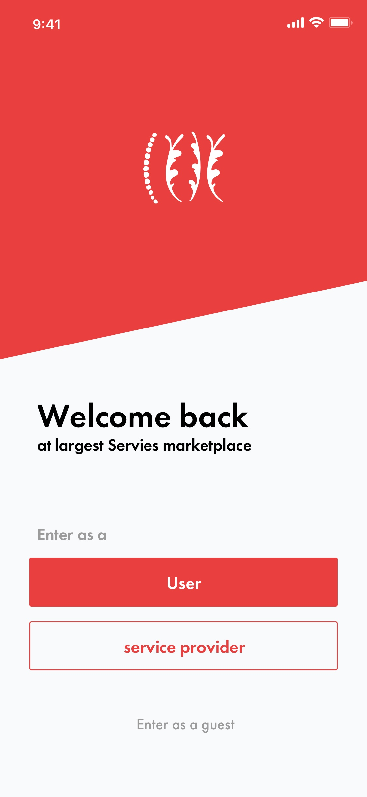
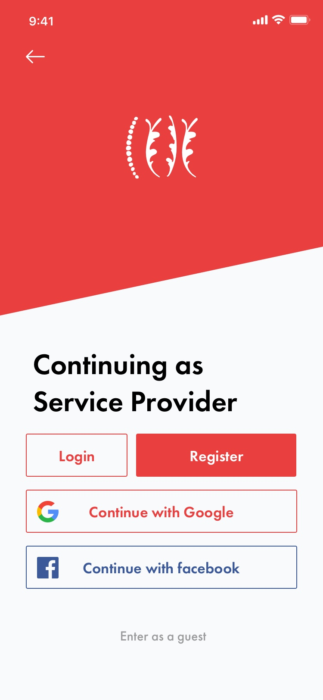
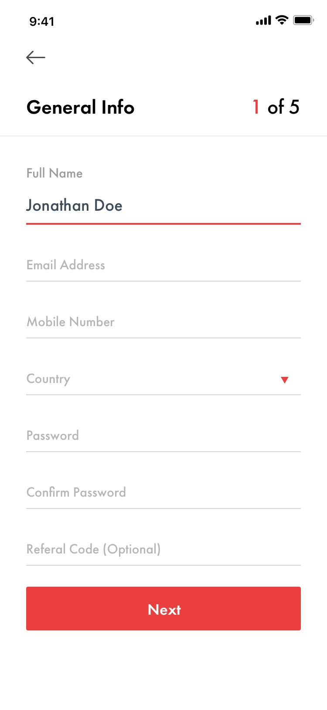
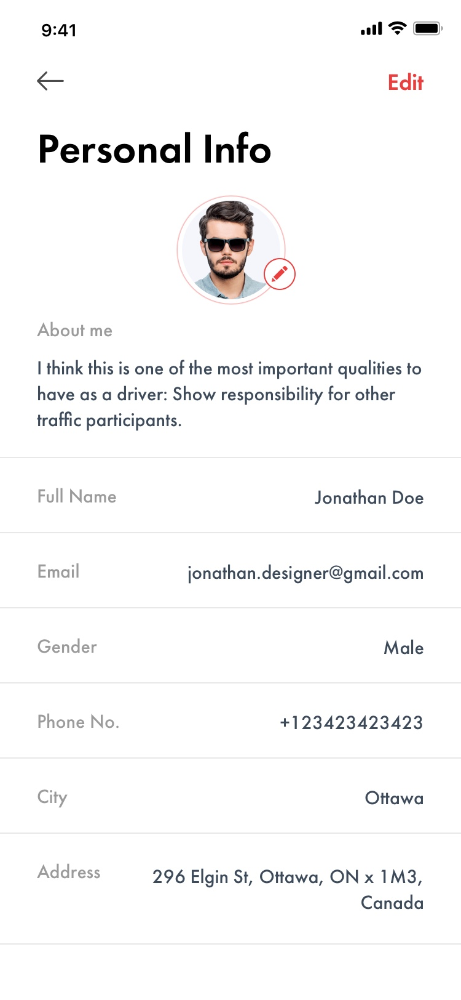

# Latihan 2

Buatlah Layout XML dari desain berikut ini :

Starter Code untuk tugas ini ada pada link berikut ini : [Starter Code Latihan 2](https://github.com/polinema-mobile/2020-mobile-02)

## Halaman Welcome

## Halaman Login

## Halaman Register

## Halaman Profile
