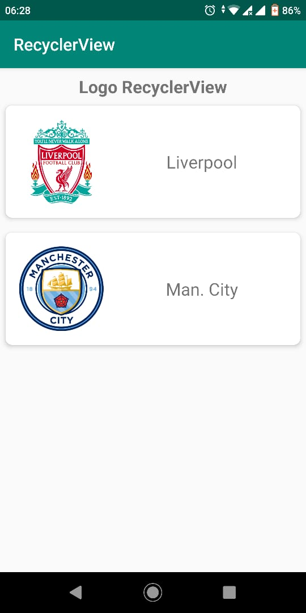

# Praktikum RecyclerView

Silahkan amati layout tampilan yang diharapkan berikut.



> **Catatan**: Untuk memberikan efek timbul pada layout digunakan `CardView`.
> Gambar akan diambil dari internet menggunakan
> library `Picasso` atau `Glide`.

> - Untuk Picasso tambahkan baris ini untuk menambahkan library pada `build.gradle`

>   ```
>   implementation 'com.squareup.picasso:picasso:2.71828'
>   ```

> - Untuk Glide tambahkan baris ini untuk menambahkan library pada `build.gradle`

>   ```
>   implementation 'com.github.bumptech.glide:glide:4.11.0'
>   annotationProcessor 'com.github.bumptech.glide:compiler:4.11.0'
>   ```

## Langkah-langkah

- Bukalah model `TeamLogo`, pada tampilan yang diinginkan dibutuhkan 2 buah
 informasi yaitu url logo dan nama club. Tambahkan atribut-atribut tersebut
 serta buatlah constructor dan getter-setter.

| Atribut | Tipe   | Keterangan                |
| ---     | ---    | ---                       |
| logo    | String | Menyimpan url gambar logo |
| name    | String | Menyimpan nama club       |

- Bukalah class `LogoAdapter`. Class ini bertanggung jawab untuk mengatur data
 dan menampilkan sesuai dengan tampilan yang diinginkan. Sebuah Adapter harus
 diturunkan dari class `RecyclerView.Adapter` dan mendefinisikan `ViewHolder`.
 Ubahlah `LogoAdapter` sehingga menjadi seperti berikut:

  ```java
  public class LogoAdapter extends RecyclerView.Adapter<LogoAdapter.ViewHolder> {

  }
  ```

- Dengan menggunakan fitur dari Android Studio, generate method, import dan
 class yang dibutuhkan dengan menggunakan shortcut `Alt + Enter`.

- Kemudian tambahkan dua buah atribut berikut:

  ```java
  private Context context;
  private List<TeamLogo> items;
  ```

- Generate constructor dengan menggunakan shortcut `Cmd + N` (mac) atau `Alt +
 Insert` (windows atau linux).

  ```
  public LogoAdapter(Context context, List<TeamLogo> items) {
    this.context = context;
    this.items = items;
  }
  ```

- Lengkapi inner class `ViewHolder` terlebih dahulu. Pada ViewHolder terdapat 2
 buah komponen yaitu: `ImageView` dan `TextView`. Tambahkan atribut berikut ke
 dalam inner class `ViewHolder`.

  ```java
  ImageView logoImage;
  TextView nameText;
  ```

- Lakukan binding variabel dengan tampilan view.

  ```java
  public ViewHolder(@NonNull View itemView) {
    super(itemView);
    logoImage = itemView.findViewById(R.id.image_logo);
    nameText = itemView.findViewById(R.id.text_name);
  }
  ```

  > **Catatan**: ada tambahan parameter `itemView` untuk proses `findViewById`.

- Kemudian lengkapi method-method yang masih belum diimplementasikan.
- Pada `onCreateViewHolder()` tambahkan baris berikut untuk membuat instansiasi
 `ViewHolder`.

  ```java
	@NonNull
	@Override
	public ViewHolder onCreateViewHolder(@NonNull ViewGroup parent, int viewType) {
    View view = LayoutInflater.from(context)
      .inflate(R.layout.item_logo, parent, false);
    return new ViewHolder(view);
  }
  ```

- Pada `onBindViewHolder()` tambahkan baris berikut.

  ```java
	@Override
	public void onBindViewHolder(@NonNull ViewHolder holder, int position) {
		TeamLogo item = items.get(position);
    // Atur image di baris ini, dapat menggunakan Picasso atau Glide
		holder.nameText.setText(item.getName());
	}
  ```

  > **Picasso**: Untuk menampilkan gambar dengan picasso
  > ```java
  > Picasso.get().load(item.getLogo()).into(holder.logoImage);
  > ```

  > **Glide**: Untuk menampilkan gambar dengan glide
  > ```java
  > Glide.with(context).load(item.getLogo()).into(holder.logoImage);
  > ```

- Pada `getItemCount()` tambahkan baris berikut.

  ```java
	@Override
	public int getItemCount() {
		return (items != null) ? items.size() : 0;
	}
  ```

  > **Catatan**: kode ini merupakan shorthand dari kondisi if-else
  > ```java
  > if (items != null) {
  >   return items.size();
  > } else {
  >   return 0
  > }
  > ```

- Bukalah class `LogoActivity` dan tambahkan kode berikut dalam method
 `onCreate()`.

  ```java
  RecyclerView teamsView = findViewById(R.id.rv_teams);

  List<TeamLogo> teams = new ArrayList<>();
  teams.add(new TeamLogo("https://upload.wikimedia.org/wikipedia/en/thumb/0/0c/Liverpool_FC.svg/360px-Liverpool_FC.svg.png", "Liverpool"));
  teams.add(new TeamLogo("https://upload.wikimedia.org/wikipedia/en/thumb/e/eb/Manchester_City_FC_badge.svg/360px-Manchester_City_FC_badge.svg.png", "Man. City"));

  LogoAdapter adapter = new LogoAdapter(this, teams);
  teamsView.setAdapter(adapter);

  RecyclerView.LayoutManager layoutManager = new LinearLayoutManager(this);
  teamsView.setLayoutManager(layoutManager);
  ```

- Lengkapi tombol menu pada class `MainActivity` kemudian jalankan aplikasi.
- Amati hasil dari aplikasi, dan cobalah untuk menambahkan data baru.
