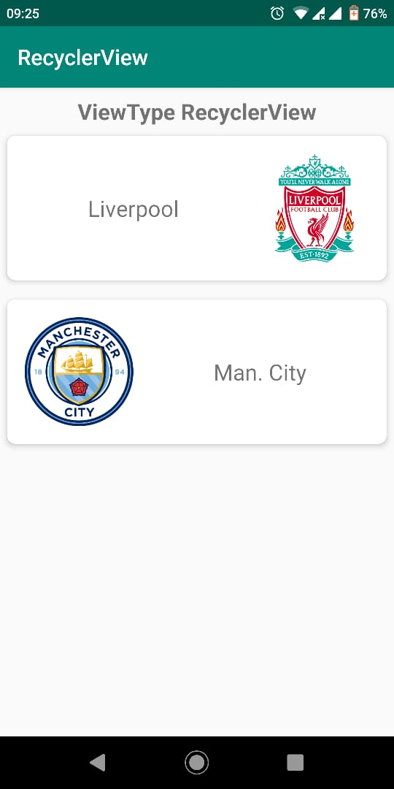

# RecyclerView dengan ViewType

Adakalanya tampilan RecyclerView tidak selalu menampilkan tampilan item yang
homogen. Tampilan tiap item dapat dikustomisasi berdasarkan viewtype. Untuk
melakukan ini tinggal meng-*override* method `getItemViewType()`. Berikut contoh
tampilan yang diharapkan pada praktikum ini.



## Langkah-langkah

- Perbedaan utama untuk membuat tampilan ini hanya pada tambahan implementasi
 method `getItemViewType()` dan `onCreateViewHolder()`. Langkah-langkah lainnya
 silahkan mengikuti praktikum sebelumnya.

- Bukalah class `ReversedLogoAdapter`, dan atur menjadi turunan dari `RecyclerView.Adapter`
- Adapter bertugas untuk mengatur apakah tampilan logo berada di sebelah kiri
 atau kanan. Untuk memudahkan tambahkan 2 buah konstanta berikut.

  ```java
  private static final int LOGO_LEFT = 1;
  private static final int LOGO_RIGHT = 2;
  ```

- Pada method `onCreateViewHolder()` tambahkan logika untuk mengatur jika
 parameter `viewType` adalah `LOGO_LEFT` maka gunakan layout `item_logo.xml` dan
 jika `LOGO_RIGHT` maka gunakan layout `item_logo_reversed.xml`.

  ```java
  View view = null;
  if (viewType == LOGO_LEFT) {
    view = LayoutInflater.from(context)
        .inflate(R.layout.item_logo, parent, false);
  } else if (viewType == LOGO_RIGHT) {
    view = LayoutInflater.from(context)
      .inflate(R.layout.item_logo_reversed, parent, false);
  }
  return new ReversedLogoAdapter.ViewHolder(view);
  ```

- Nilai parameter `viewType` diatur oleh method `getItemViewType()`. Jika data
 ganjil tampilkan logo di sebelah kanan, dan jika genap sebaliknya. (Perhitungan
 data dimulai dari index 0). Tambahkan baris kode berikut untuk
 mengimplementasikan logika tersebut.

  ```java
	@Override
	public int getItemViewType(int position) {
		return (position % 2 == 0) ? LOGO_RIGHT : LOGO_LEFT;
	}
  ```

- Untuk langkah selanjutnya silahkan mengikuti langkah-langkah praktikum
 sebelumnya.
