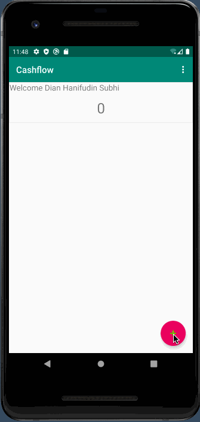

# Aplikasi Kas Sederhana

Pada praktikum kali ini akan dibuat aplikasi tentang pencatatan uang masuk dan
uang keluar sederhana. Jika transaksi merupakan debit, maka akan mengurangi
saldo. Tetapi jika transaksi merupakan kredit, maka sebaliknya. Tampilan
aplikasi seperti yang ada pada demo animasi berikut. Starter code telah
dilampirkan, silahkan dipelajari dengan seksama.

Silahkan ikuti instruksi-instruksi pada laman berikutnya untuk membangun
aplikasi kas sederhana.
