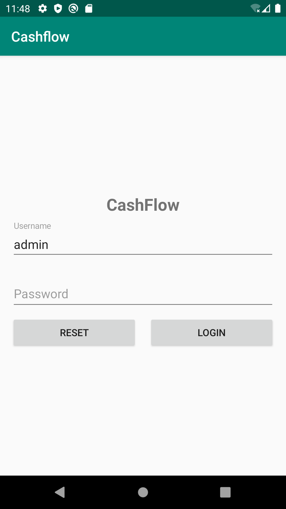
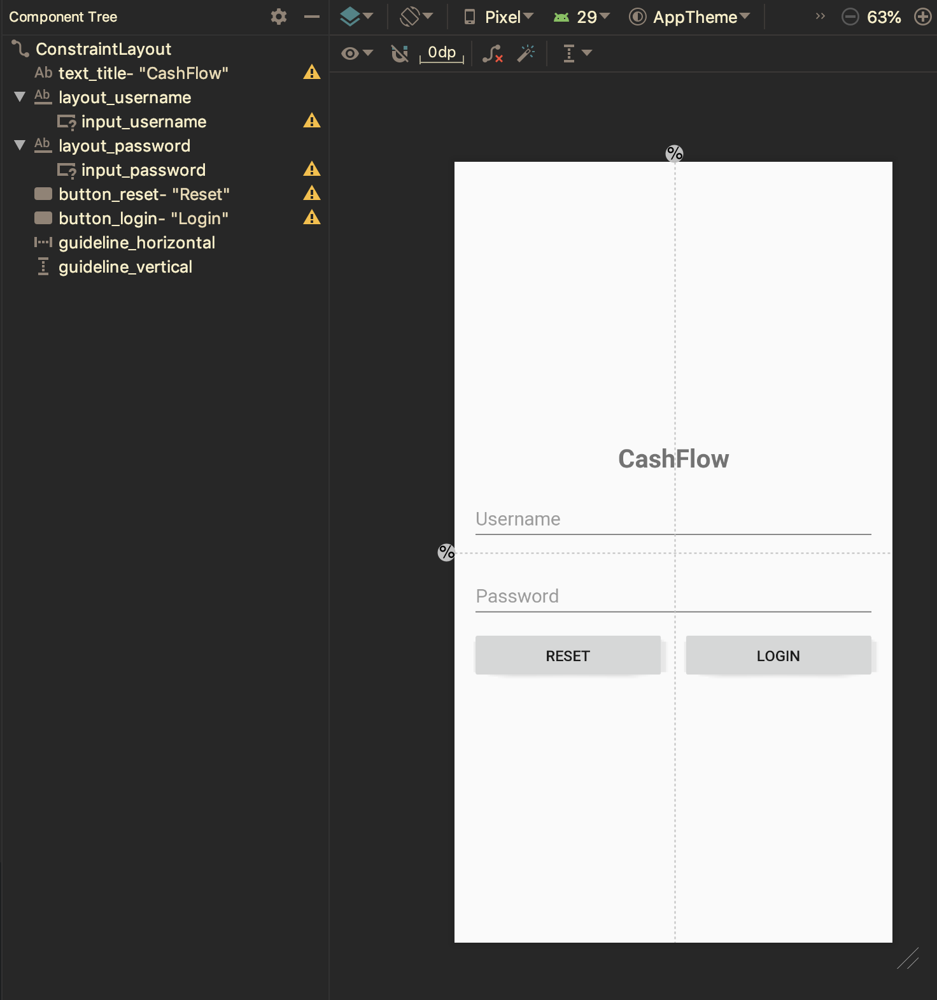

# Login

Dengan memanfaatkan SharedPreferences dapat digunakan untuk mengimplementasikan
fitur login pada aplikasi. Sebuah session dapat disimpan pada SharedPreferences,
data ini yang dijadikan sebagai acuan apakah perlu ditampilkan halaman login
atau tidak.

## Implementasi

Pada gambar berikut, disajikan tampilan layout yang digunakan untuk membuat
halaman login.



Silahkan ikuti langkah-langkah berikut untuk mengimplementasikan fitur login:

- Buatlah activity baru dan berilah nama `LoginActivity` dan desainlah sesuai
 layout yang dibutuhkan.

- Di bawah ini disediakan informasi mengenai penamaan serta komponen yang
 dibutuhkan.



- Untuk memudahkan logika buatlah satu class `Session` pada package `models`.
 Class ini digunakan untuk memanipulasi data pada `SharedPreferences`.

  ```java
  public class Session {

      private static final String USERNAME_KEY = "key_username";
      private static final String TOKEN_KEY = "key_token";

      private SharedPreferences preferences;

      public Session(Context context) {
          preferences = PreferenceManager.getDefaultSharedPreferences(context);
      }

      public String getUsername() {
          return preferences.getString(USERNAME_KEY, null);
      }

      public void setUsername(String username) {
          preferences.edit().putString(USERNAME_KEY, username)
                  .apply();
      }

      public void setSession(String token) {
          preferences.edit().putString(TOKEN_KEY, token)
                  .apply();
      }

      public boolean isLoggedIn() {
          String token = preferences.getString(TOKEN_KEY, null);
          return (token != null);
      }

      public boolean validate(String username, String password) {
          if (username.equals("admin") && password.equals("rahasia")) {
              setSession(username);
              return true;
          }
          return false;
      }

      public void logout() {
          preferences.edit().remove(TOKEN_KEY)
                  .apply();
      }
  }
  ```

  > **Catatan**: Pada aplikasi ini untuk autentikasi login hanya menggunakan
  > logika sederhana. Data disimpan secara *hardcoded*. Untuk aplikasi yang
  > sebenarnya autentikasi dapat dilakukan pada database atau REST API.

- Bukalah class `Application` dan tambahkan atribut `session` dan instansiasi
 pada method `onCreate()`.

  ```java
  public class Application extends android.app.Application {

      private static Session session;

      @Override
      public void onCreate() {
          super.onCreate();
          session = new Session(this);
      }

      public static Session getSession() {
          return session;
      }
  }
  ```

- Bukalah activity `LoginActivity`, dan definisikan atribut berikut

  ```java
  private EditText usernameInput;
  private EditText passwordInput;
  private Session session;
  ```

- Lakukan proses binding dan instansiasi dari atribut yang dibutuhkan pada
 method `onCreate()`.

  ```java
  // binding komponen


  session = Application.getSession();
  ```

- Tambahkan click pada tombol reset, dan tambahkan logika berikut.

  ```java
  usernameInput.setText("");
  passwordInput.setText("");
  ```

- Pada tombol login, lakukan proses autentikasi dari nilai username dan password
 yang telah dimasukkan.

  ```java
  String username = usernameInput.getText().toString();
  String password = passwordInput.getText().toString();

  boolean success = session.validate(username, password);
  if (success) {
      Intent intent = new Intent(this, MainActivity.class);
      startActivity(intent);
      finish();
  } else {
      Snackbar.make(view, "Authentication Failed", Snackbar.LENGTH_SHORT).show();
  }
  ```

- Implementasi logika login telah selesai untuk halaman `LoginActivity`. Tetapi
 masih diperlukan logika lagi untuk mengatur tampilan activity awal yang akan
 dijalankan apakah `MainActivity` atau `LoginActivity`.

- Bukalah activity `MainActivity` tambahkan atribut `session` yang digunakan
 untuk memanipulasi data pada `SharedPreferences`.

  ```java
  private Session session;
  ```

- Instansiasi atribut session pada method `onCreate()`.

  ```java
  session = Application.getSession();
  ```

- Tambahkan juga logika untuk mengatur apabila telah ada session maka tidak
 diperlukan untuk melakukan login.

  ```java
  if (!session.isLoggedIn()) {
      Intent intent = new Intent(this, LoginActivity.class);
      startActivity(intent);
      finish();
  }
  ```

- Jalankan aplikasi kemudian ujilah apakah aplikasi sudah berjalan sesuai yang
 diinginkan.
